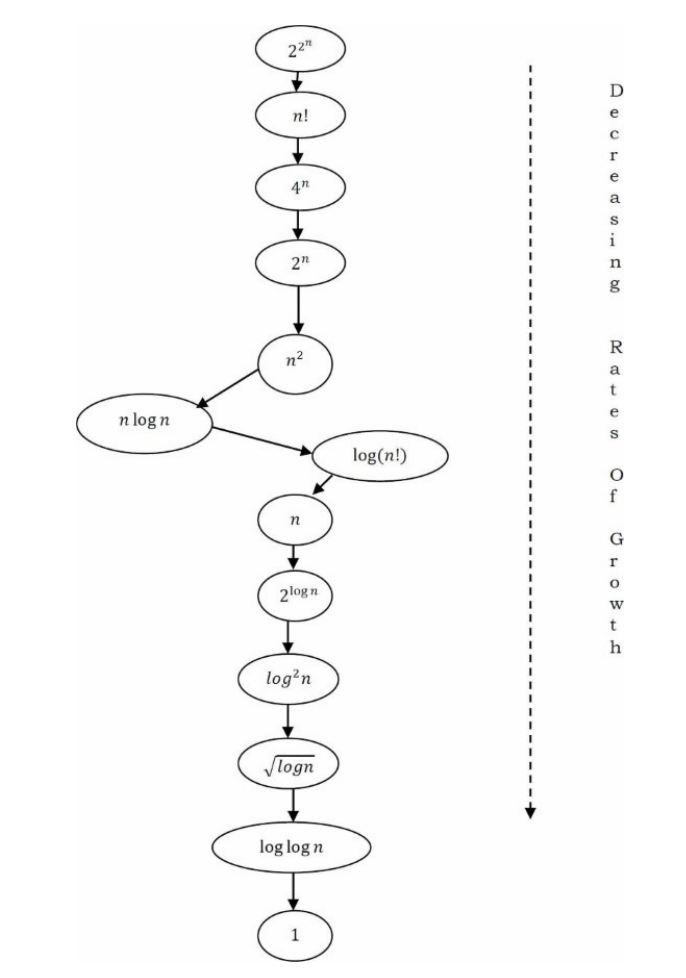
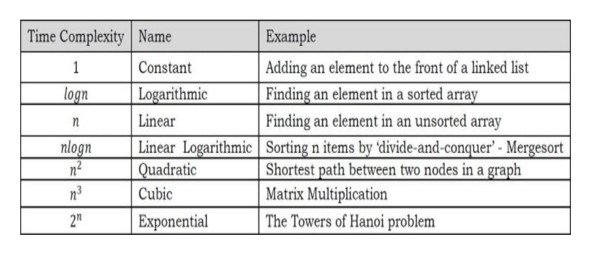
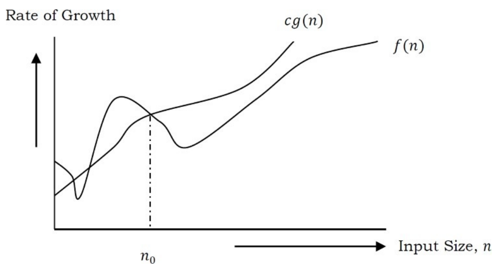
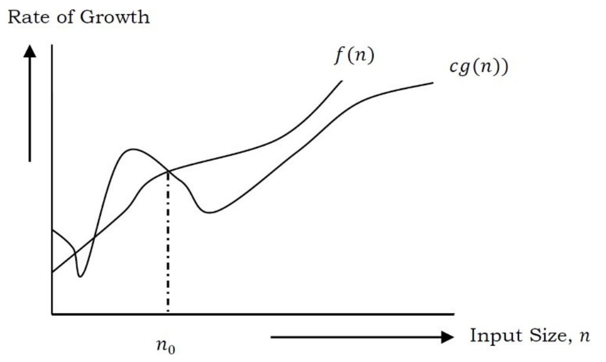
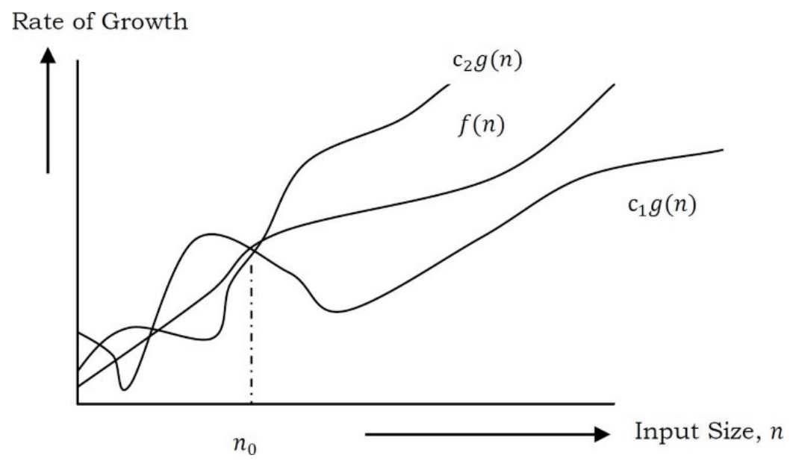
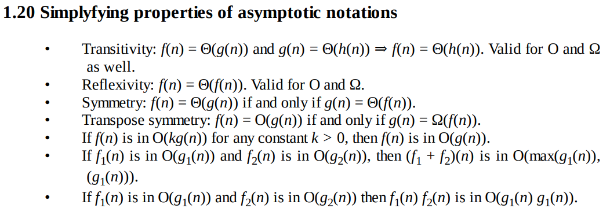
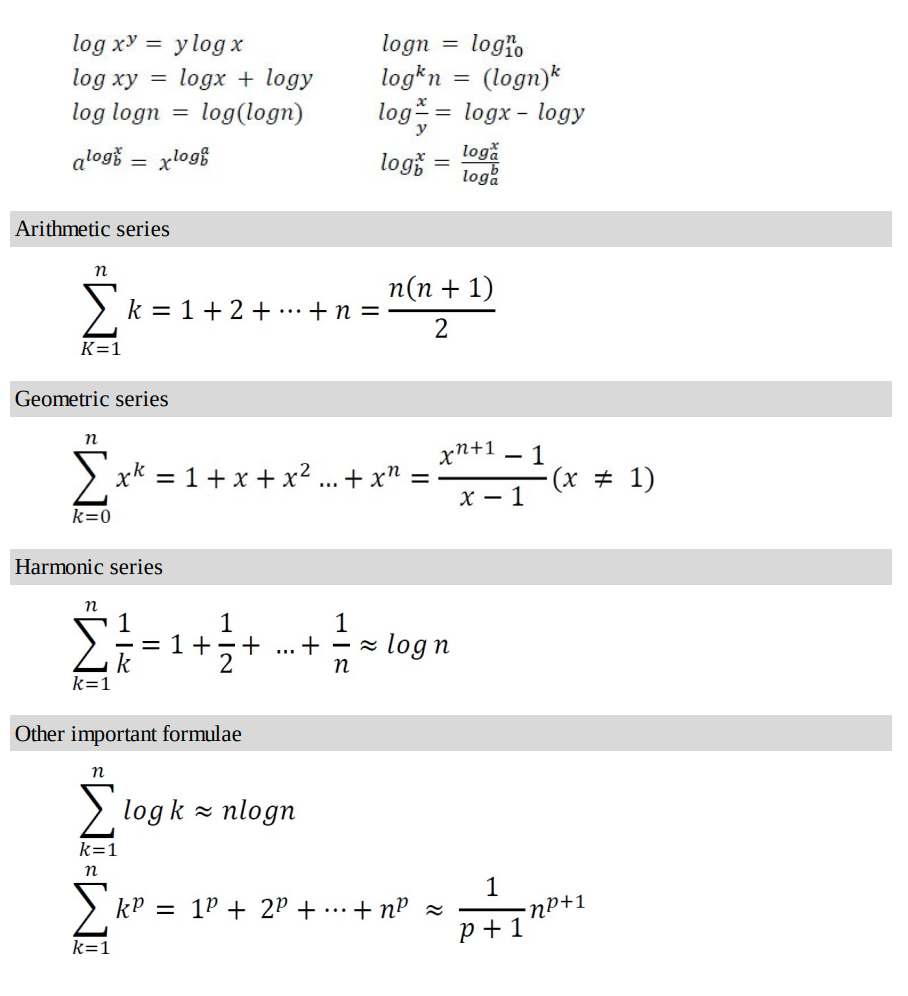
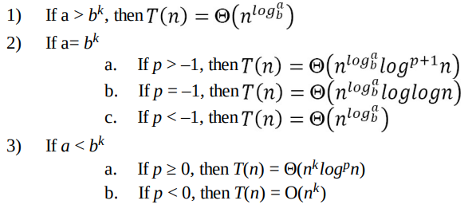

### Day One

##### What is Rate of Growth?
The rate at which the running time increases as a function of input is called rate of growth. 

##### Commonly Used Rates of Growth

##### Rates of Growth and Examples

We represent the algorithm with multiple expressions: one for the case where it takes less time and another for the case where it takes more time.

In general, the first case is called the **best case** and the second case is called the **worst case** for the algorithm. To analyze an algorithm we need some kind of syntax, and that forms the base for asymptotic analysis/notation. There are three types of analysis:

- **Worst case**
   1. Defines the input for which the algorithm takes a long time (slowest time to complete).
   2. Input is the one for which the algorithm runs the slowest.
- **Best case**
   1. Defines the input for which the algorithm takes the least time (fastest time to complete).
   2. Input is the one for which the algorithm runs the fastest.
- **Average case**
   1. Provides a prediction about the running time of the algorithm.
   2. Run the algorithm many times, using many different inputs that come from some distribution that generates these inputs, compute the total running time (by adding the individual times), and divide by the number of trials.
   3. Assumes that the input is random. 

### Asymptotic Notations

- ***Big-O Notation [Upper Bounding Function]***

    O(g(n)) = {f(n): there exist positive constants c and n0 such that 0 ≤ f(n) ≤ cg(n) for all n > n0}, g(n) is an asymptotic tight upper bound for f(n).

  1. This notation gives the tight upper bound of the given function. Generally, it is represented as f(n) = O(g(n)). That means, at larger values of n, the upper bound of f(n) is g(n). For example, if f(n) = n4 + 100n2 + 10n + 50 is the given algorithm, then n4 is g(n). That means g(n) gives the maximum rate of growth for f(n) at larger values of n.

  2. Our objective is to give the smallest rate of growth g(n) which is greater than or equal to the given algorithms’ rate of growth /(n).

  3. O(g(n)) is the set of functions with smaller or the same order of growth as g(n). For example : O(n2) includes O(1), O(n), O(nlogn), etc.

- ***Omega-Q Notation [Lower Bounding Function]***

    Ω(g(n)) = {f(n): there exist positive constants c and n0 such that 0 ≤ cg(n) ≤ f(n) for all n ≥ n0}. g(n) is an asymptotic tight lower bound for f(n).

  1. This notation gives the tighter lower bound of the given algorithm and we represent it as f(n) = Ω(g(n)). That means, at larger values of n, the tighter lower bound of f(n) is g(n). For example, if f(n) = 100n2 + 10n + 50, g(n) is Ω(n2).

  2. Our objective is to give the largest rate of growth g(n) which is less than or equal to the given algorithm’s rate of growth f(n).

- ***Theta-Θ Notation [Order Function]***

    Θ(g(n)) = {f(n): there exist positive constants c1 ,c2 and n0 such that 0 ≤ c1g(n) ≤ f(n) ≤ c2g(n) for all n ≥ n0}. g(n) is an asymptotic tight bound for f(n).

  1. This notation decides whether the upper and lower bounds of a given function(algorithm) are the same. The average running time of an algorithm is always between the lower bound and the upper bound.

  2. If the upper bound (O) and lower bound (Ω) give the same result, then the Θ notation will also have the same rate of growth.

  3. Θ(g(n)) is the set of functions with the same order of growth as g(n).

#### Why is it called Asymptotic Analysis?

- For all three notations: worst case, best case, and average case, we can easily understand that, in every case for a given function f(n) we are trying to find another function g(n) which approximates f(n) at higher values of n. That means g(n) is also a curve which approximates f(n) at higher values of n.

- In mathematics we call such a curve an asymptotic curve. In other terms, g(n) is the asymptotic curve for f(n). For this reason, we call algorithm analysis asymptotic analysis.

### Properties :

### Commonly Used Logs and Summations :

### Master Theorem for Divide and Conquer Recurrences : 

- For a given program (algorithm), first we try to find the recurrence relation for the problem. If the recurrence is of the below form then we can directly give the answer without fully solving it. If the recurrence is of the form , where a ≥ 1,b > 1,k ≥ 0 and p is a real number, then:

