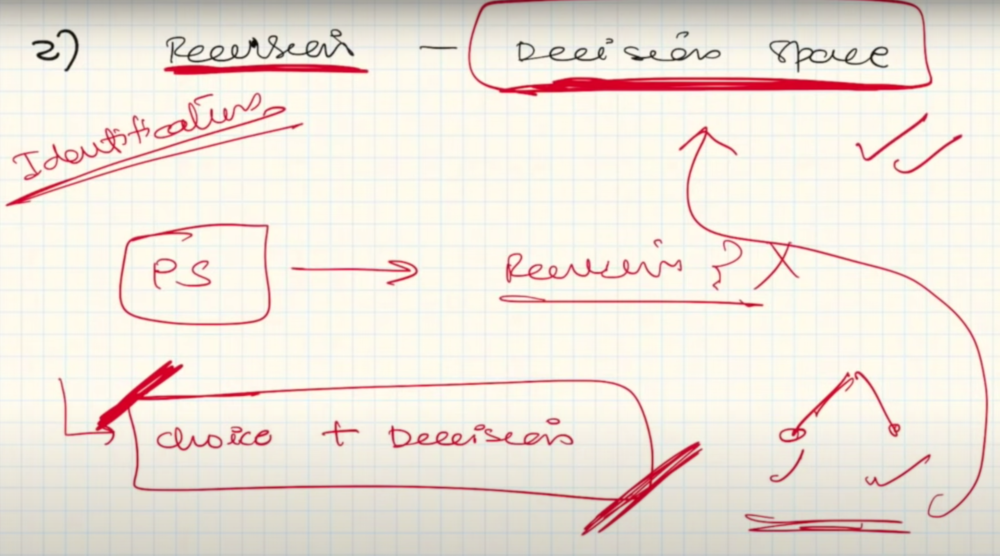
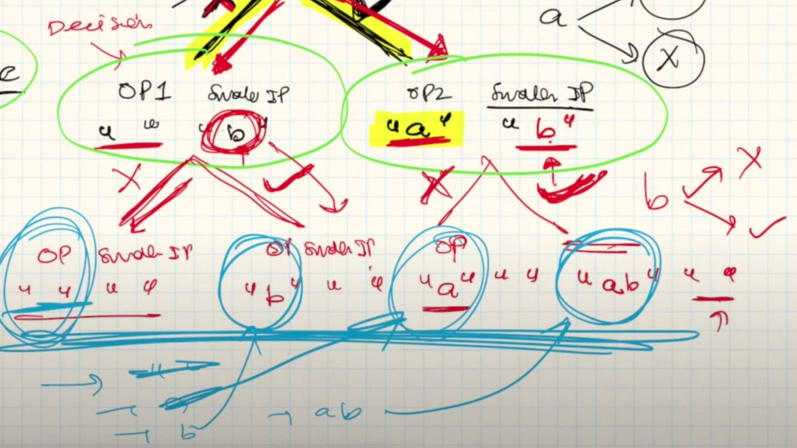
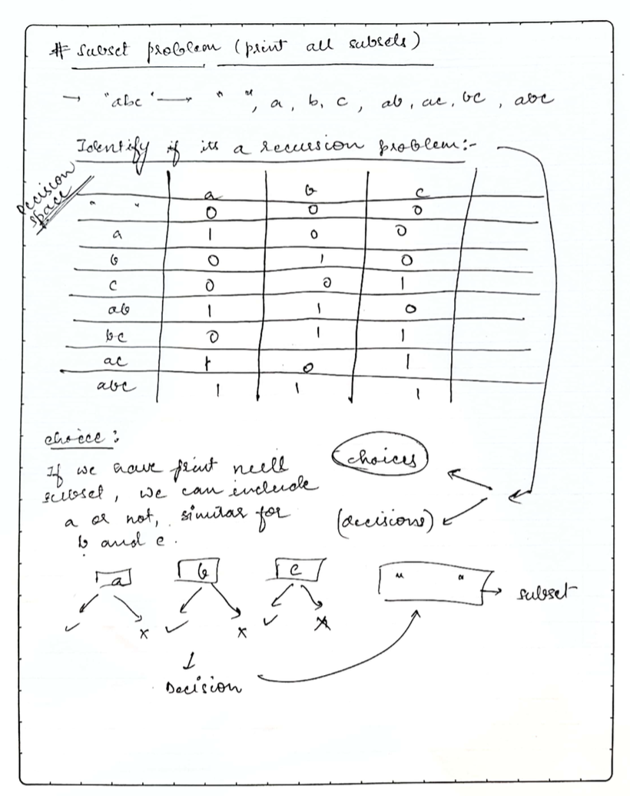

# Day Three

## Recursion

### Make input smaller, but why?

- We do not make the input smaller deliberately, it automatically becomes small
- We take decisions in the result of which the exisiting problem becomes smaller.

### Recursion - Decision Space

### Recursion Tree

### Recursion Tree - Input/Output Method

### Recursion Tree - Input/Output Method - Example

### 2 steps to solve Recursive Problem

- Design the Recursion Tree
- Write the code